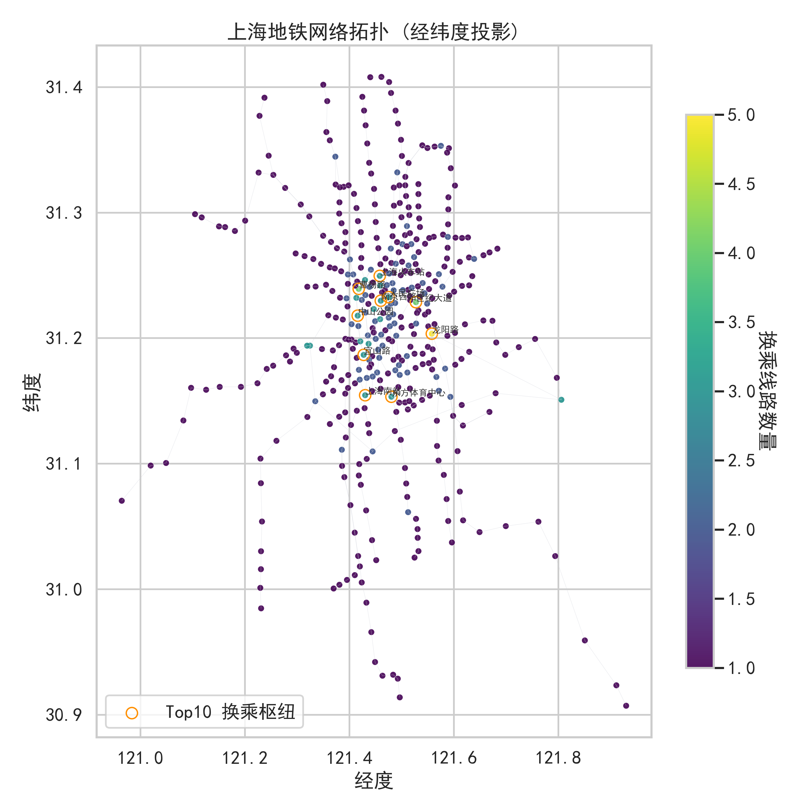
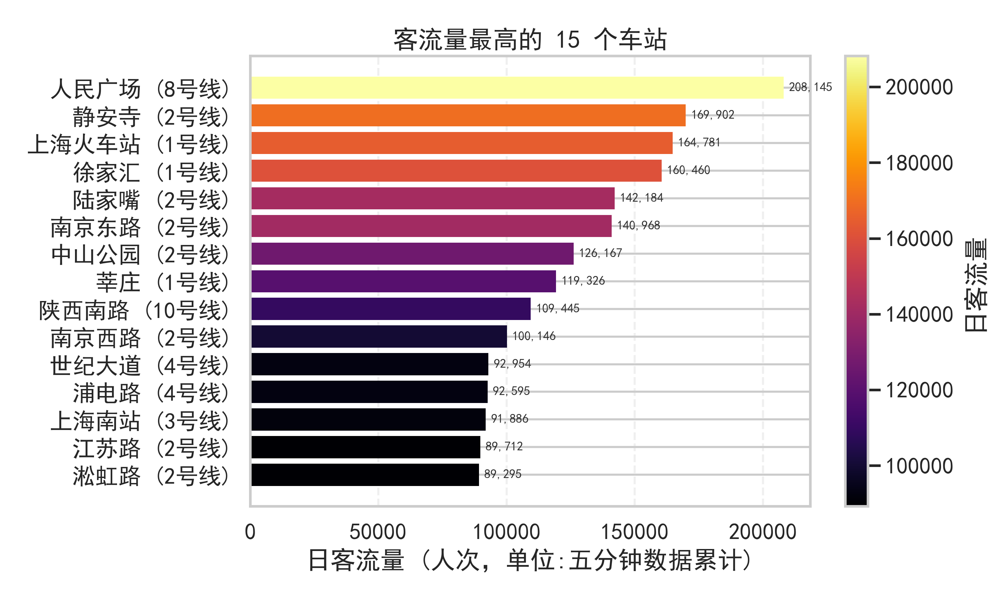
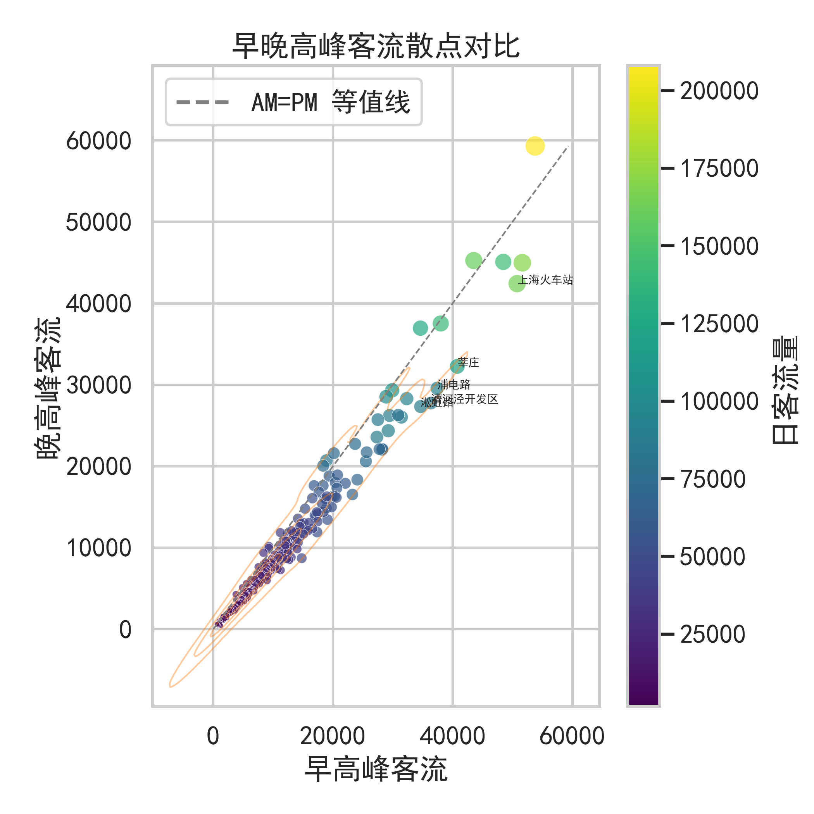

# Shanghai Metro Insight Lab

一键爬取高德线路 + GitHub 站点客流，基于 NetworkX 与 PyTorch GCN 构建上海地铁的网络/客流全景视图，可直接用于汇报或演示。

## 快速上手
```bash
conda activate fk
python metro_fetch.py     # 抓取线路与5分钟客流CSV
python metro_analysis.py  # 产出网络指标、图表、report
python metro_model.py     # 训练GCN并补齐客流预测
```

核心数据输出均位于 `data/`，其中 `data/report.md` 为中文摘要。

## 关键可视化
<p align="center">
  
  
</p>
<p align="center">
  
  
</p>

更多图表请参见 `data/figures/`。

